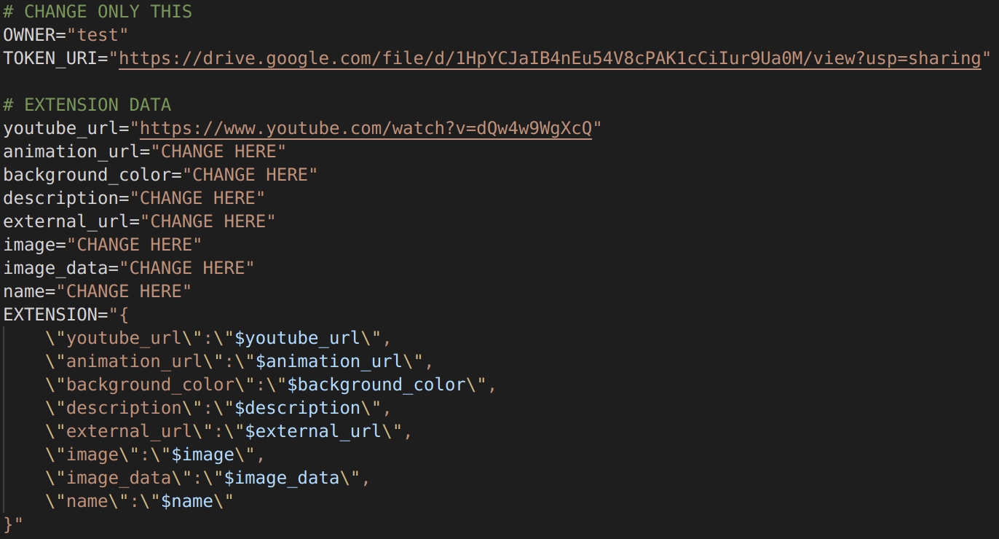
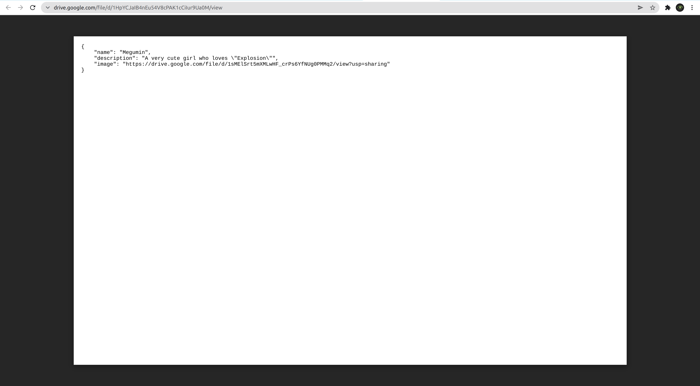
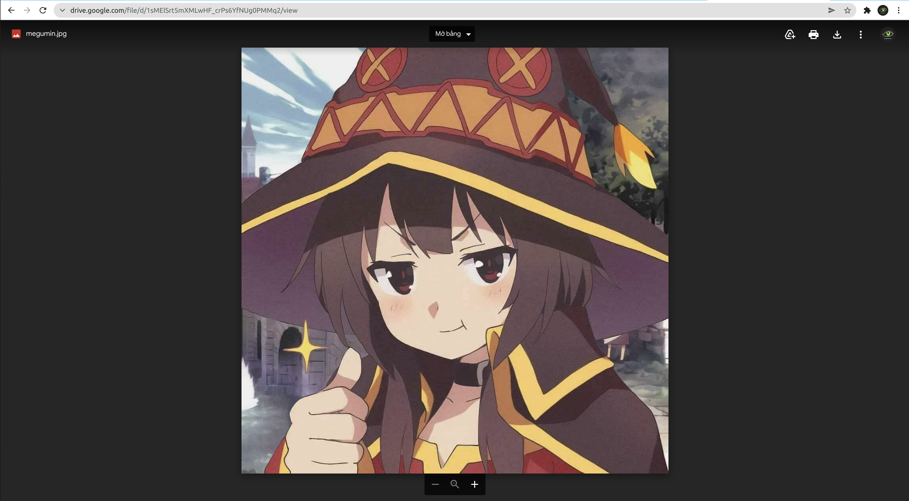
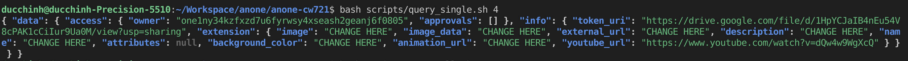

## How to mint an NFT 
Here is a tutorial on how you can mint your NFT with Another-1.
Open your terminal in anone project and write this following statements:
```	
git checkout wasm-import
cd anone-cw721
bash scripts/mint.sh
```
Before running the third command to mint an NFT, you need to configure the information for this NFT in the mint.sh file:
**Required data** is stored in token_uri, following the convention in anone-cw721/default_nft/ERC_721_FORMAT.json, includes: name, description and image (URL to NFT image)
And you can add some **extension data** such as:
- youtube_url: A URL to a YouTube video.
- animation_url: A URL to a multi-media attachment for the item. The file extensions GLTF, GLB, WEBM, MP4, M4V, OGV, and OGG are supported, along with the audio-only extensions MP3, WAV, and OGA. Animation_url also supports HTML pages, allowing you to build rich experiences and interactive NFTs using JavaScript canvas, WebGL, and more. Scripts and relative paths within the HTML page are now supported. However, access to browser extensions is not supported.
- background_color: Background color of the item on Another-1 NFT Marketplace. Must be a six-character hexadecimal without a pre-pended #.
- description: A human readable description of the item. Markdown is supported.
- external_url: This is the URL that will appear below the asset's image on Another-1 NFT Marketplace and will allow users to leave Another-1 NFT Marketplace and view the item on your own site or on your profile on platforms for designers, artists such as Behance, Dribbble,...
- image: This is the URL to the image of the iteHere is a tutorial on how you can mint your NFT with Another-1.m. Can be just about any type of image (including SVGs, which will be cached into PNGs), and can be IPFS URLs or paths. We recommend using a 350 x 350 image.
- image_data: Raw SVG image data, if you want to generate images on the fly (not recommended). Only use this if you're not including the image parameter.
- name: Name of the item.

Here are some pictures to help you get an idea of how to set up your information for your NFT:




After successfully minting your NFT, you can check the information using the query command:
```
bash scripts/query_single.sh YOUR_NFT_TOKEN_ID
```
For example I have successfully minted my NFT with token_id is 4, I can query it with the command: `bash scripts/query_single.sh 4`. You can see this in the photo below:

That's it, I showed you how to successfully mint your NFT with Another-1. If you have any problems, please talk to me on the chat channel in discord. Good luck!